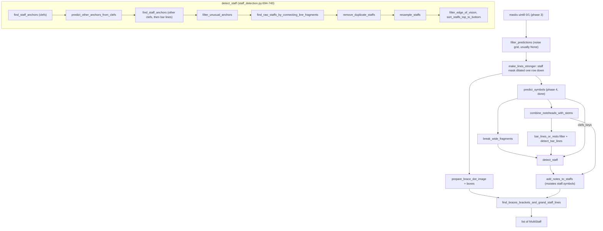

# Phase 5: staff, note, brace and bar-line detection in homr 0.7.0, and what a faithful TypeScript port builds on

Python root: `/Users/jymen/development/homr-web/.venv/lib/python3.12/site-packages/homr/` (abbreviated `H/`). Oracle environment: numpy 2.5.3, opencv-python-headless 4.14.0, Python 3.12, arm64 macOS. TypeScript root: `/Users/jymen/development/homr-web/src`. All Python line numbers are of the installed 0.7.0 files. Claims marked **[checked]** were re-run for this synthesis with throwaway probe scripts that are not committed; everything else comes from three explorer reports (the staff chain, the notes and model code, and the existing homr-web tree) and was cross-read against the code. The `aquicksort` transcription one probe used is now `aquicksort` in `tools/dump-vectors.py`.

## Overview

`detect_staffs_in_image` (`H/main.py:232-296`) takes the segnet masks that phase 3 produced and turns them into `list[MultiStaff]`. It does so in three layers. First it builds per-class boxes (`predict_symbols`, already ported in phase 4) and tidies them: staff-line fragments wider than 100 px are cut, noteheads are paired with stems, and bar lines are filtered by size. Second, `detect_staff` (`H/staff_detection.py:694-740`) finds "anchors" (a clef or a bar line crossing exactly five line fragments), joins line fragments into five continuous lines per anchor, merges anchors that describe the same staff, and resamples each staff onto a 10 px x grid of five-line `StaffPoint`s. Third, notes are attached to staffs, and neighbouring staffs joined by a tall narrow symbol (brace, bracket, barline connector) are grouped into `MultiStaff`s, with two-staff groups scored and fused into 10-line grand staffs.

Three facts change the scope the phase 5 plan assumed, all **[checked]** against the code. (1) Only `Note`s are ever put on a staff: `add_symbol` has one call site, `H/note_detection.py:180`, and no `BarLine`, `Clef`, `Rest` or `Accidental` is constructed anywhere outside `model.py`. So `Staff.get_bar_lines()` and `get_clefs()` are always empty, and two of the three connection finders in `brace_dot_detection.py` always return `[]`. (2) The notes feed only `notes.json` and the `symbols` lists inside `multistaffs.json`; nothing downstream reads their position, stem or direction. (3) The `staff_detection.py` file is 740 lines, not the 828 the plan says, and it has no `float32` cast; float32 enters only through opencv's `minAreaRect`/`boxPoints` results.

The Kesh fixture exercises the main staff path well (24 clef anchors, 100 bar-line anchors, one `find_peaks` call, four staffs) and exercises almost nothing of the brace, grand staff, noise-filter and missed-clef paths. The port is therefore mostly a literal transcription whose later halves can only be checked against synthetic inputs run through the Python.

## Reconciled Points

### 1. Authoritative order of `detect_staffs_in_image` (`H/main.py`)

| # | Lines | Step | Reads | Returns | Mutates |
|---|---|---|---|---|---|
| 1 | 235 | `load_and_preprocess_predictions` (106-129): imread, autocrop, resize, CLAHE, `get_predictions` (117), `Debug(original)` (118, unfiltered), `filter_predictions` (121), `predictions.staff = make_lines_stronger(staff, (1,2))` (123) | image path | `(InputPredictions, Debug)`; all masks uint8 0/1 | `predictions.staff` is reassigned (on the new object if the noise mask fired, else the original). When the mask fired, all seven arrays including `original` and `preprocessed` are `bitwise_and`-ed |
| 2 | 238 | `predict_symbols` (132-151) | `predictions` masks | `PredictedSymbols` (noteheads, staff_fragments, clefs_keys, stems_rest, bar_lines) | nothing |
| 3 | 240 | `break_wide_fragments` | `symbols.staff_fragments` | new list | assigns the new list to `symbols.staff_fragments`; the old list is untouched |
| 4 | 244-248 | `combine_noteheads_with_stems` | `symbols.noteheads`, `symbols.stems_rest` | `list[NoteheadWithStem]`; empty raises `Exception("No noteheads found")` | nothing (sorted copy) |
| 5 | 250-252 | `average_note_head_height = float(np.median(notehead.size[1]))` | step 4 | float | nothing |
| 6 | 255-262 | `all_noteheads`, `all_stems` (stem not None, duplicates possible), `bar_lines_or_rests` = bar lines overlapping neither list | `symbols.bar_lines`, step 4 | list, order preserved | nothing |
| 7 | 263 | `detect_bar_lines(bar_lines_or_rests, average_note_head_height)` | steps 5, 6 | list of the same box objects | nothing |
| 8 | 270-274 | `detect_staff(debug, predictions.staff, symbols.staff_fragments, symbols.clefs_keys, bar_line_boxes)`; empty raises `Exception("No staffs found")` | the **dilated, noise-filtered** staff mask (only for `image.shape` and column slices), broken fragments, clefs, bar-line boxes | `list[Staff]` sorted by `min_y` | nothing |
| 9 | 275 | `detect_title(debug, staffs[0])`: submits to a one-worker thread pool | `staffs[0].average_unit_size/min_x/max_x/min_y`, the unfiltered original | `Future[str]`, consumed only in `process_image:207` | nothing it shares with `multi_staffs`; the port drops it |
| 10 | 278-280 | `prepare_brace_dot_image(predictions.symbols, predictions.staff)` then `create_rotated_bounding_boxes(img, skip_merging=True, max_size=(100, -1))` | symbols mask, dilated staff mask | `brace_dot: list[RotatedBoundingBox]` | nothing |
| 11 | 282-284 | `add_notes_to_staffs(staffs, noteheads_with_stems, predictions.symbols, predictions.notehead)` | step 4 list, notehead mask (the `symbols` argument is unused) | `list[Note]`, used only by a debug call | **appends `Note`s to each `staff.symbols`** (the only in-place mutation of `staffs`) |
| 12 | 286 | `find_braces_brackets_and_grand_staff_lines(debug, staffs, brace_dot)` | staffs, brace_dot | `list[MultiStaff]` | nothing; the `Staff` objects inside `MultiStaff`s are the same objects as in `staffs`, and identity matters to the merge (`Staff` has no `__eq__`) |
| 13 | 296 | `return multi_staffs, predictions.preprocessed, debug, title_future` | | | |

The explorers numbered these differently only because one counted `predict_symbols` and the bar-line filter as separate steps and the other folded them. There is no contradiction in behaviour. The only exits are the two `Exception`s (248, 274) and the `InvalidProgramArgumentException` at 111, plus the unguarded `IndexError`s listed under Gotchas.

### 2. Which phase 5 call sites sum more than 7 values

numpy's `np.sum`/`np.mean`/`np.std` on float64 use pairwise summation **[checked]**. The algorithm, bit-exact against numpy in 2940 random trials (n from 2 to 5000, including 127/128/129/130, 255-257, 1000, 2718) for `sum`, `mean` and `std`:

```
pw(a, lo, n):
  n < 8:      r = 0.0; for i in 0..n-1: r += a[lo+i]; return r
  n <= 128:   r0..r7 = a[lo..lo+7]
              i = 8; while i < n - (n % 8): r[j] += a[lo+i+j] for j in 0..7; i += 8
              res = ((r0+r1)+(r2+r3)) + ((r4+r5)+(r6+r7))
              while i < n: res += a[lo+i]; i += 1
              return res
  n > 128:    n2 = floor(n/2); n2 -= n2 % 8; return pw(a, lo, n2) + pw(a, lo+n2, n-n2)
mean = pw(a)/n
std  = sqrt( pw((a_i - mean)^2) / n )     // population, ddof 0; use Math.sqrt, not **0.5 (5 of 2940 differ)
```

A plain left fold agrees only for n < 8 (it disagreed with numpy in 1417 of 2940 trials). Seeding with the first element (`a[0] + pw(a[1:])`) does not match.

Call sites on the path between `predict_symbols` and the return, and whether pairwise is needed:

| Site | Values summed | Pairwise needed? |
|---|---|---|
| `staff_detection.py:304` `np.mean(all_angles)` in `are_lines_parallel` | every fragment of the five connected lines; **[checked]** on Kesh the 120 calls have n of 5 (73), 6 (15), 7 (18), 8 (5), 9 (1), 12-15 (12) | **yes**, 18 of 120 calls on Kesh |
| `staff_detection.py:520-521` `np.mean`, `np.std` in `filter_unusual_anchors` | one value per anchor, 124 on Kesh | **yes** |
| `staff_detection.py:643` `np.mean` of anchor unit sizes in `predict_other_anchors_from_clefs` | one per clef anchor, 24 on Kesh | **yes** (also feeds `distance` for `find_peaks`, but that branch only runs when anchors exist) |
| `staff_detection.py:618` `np.std(count)` in `find_horizontal_lines` | H+2 row counts (about 2718), n > 128 so the recursive split is used | **yes**; the preceding `np.mean(count)` is a sum of integers and is exact in any order |
| `staff_detection.py:491` `np.average(staff_widths)` in `filter_edge_of_vision` | one per staff, 4 on Kesh | only on pages with 8 or more staffs (not on Kesh) |
| `model.py:236` `np.mean(np.diff(y))` in `StaffPoint.__init__` | 4 diffs for a 5-line point, **9 diffs for a 10-line point** | **yes, only for 10-line points** (created by `Staff.merge`); 4 diffs is a plain fold |
| `model.py:259` `np.mean([x ...])` in `StaffPoint.transform_coordinates` | 5 or 10 | phase 6; only the 10 case |
| `staff_detection.py:113, 398, 435` | 4, 5 and at most 5 values | no |
| `staff_detection.py:569` `np.mean(np.sort(gaps)[:count])` | integers | no, exact in any order |
| `noise_filtering.py:14` `np.sum(np.sum(abs(filter2D(...))))` | the input is a 0/255 mask and the kernel is integer, so every addend is an integer-valued float below 2^53 | no, exact in any order |
| `staff_detection.py:598` `sum(norm[...])` | python `sum` over a dead result | no, and the code is dead |
| `np.median` (`main.py:251`, `model.py:281, 433`) | median does not sum; an even count averages the two middle values, `(a+b)/2` | no |

Consequence: `src/image/numeric.ts`'s `sum`, `mean` and `std` are left folds. They are correct for every call that existed before phase 5 only because those had under 8 values. Phase 5 must replace `sum` (or add `pairwiseSum`) and route `mean` and `std` through it. The golden decoder's `mean(diff(point.y))` check (`src/golden/decode.ts:524`) tolerates 1e-9, so changing it is safe.

### 3. `np.argsort` tie order in `find_peaks.py:119`

The explorer's recommendation (stable ascending sort, then reverse) is **not** what numpy does, and the explanation that numpy uses a CPU-dependent SIMD sort on this machine is wrong **[checked]**. Findings:

- On the oracle machine (arm64, numpy 2.5.3), `np.argsort` of a float64 array equals numpy's classic `aquicksort` introsort in 100% of 500 random tied arrays for each n in {5, 16, 17, 18, 20, 30, 40, 80, 200}. The algorithm is: if `pr - pl >= 16` (so n >= 17) partition, else insertion sort; the partition takes the median of `pl`, `pm = pl + ((pr-pl)>>1)` and `pr` with three conditional swaps, moves the median to `pr-1`, scans with `do ++pi while v[t[pi]] < vp` and `do --pj while vp < v[t[pj]]`, swaps until the pointers cross, restores the pivot to `pr-1`, then pushes the larger partition on a stack and continues with the smaller; the small-range insertion sort moves elements while `vp < v[t[pk]]`. The probe was about 45 lines of Python, kept as `aquicksort` in `tools/dump-vectors.py`; a TypeScript port is a direct transcription. The heapsort fallback (depth limit `2*msb(n)`) was not exercised and is not reachable with tens of peaks.
- "Stable ascending then reversed" matches numpy only for n <= 16 (insertion sort, which is stable). For n >= 17 it differs from numpy in every tied trial. On Kesh the single `find_peaks` call has 20 candidate peaks, ties exist, and the `distance` outcome agrees for numpy and for stable-then-reversed and differs for "earlier index first among ties" **[checked]**, so the fixture only rules out one wrong rule. It would not catch a divergence of stable-reverse from numpy.
- Confidence: high that a literal `aquicksort` port reproduces numpy on this build, for any input, because it was checked against numpy itself on 4500 random tied inputs. Not verified: x86. numpy 2.x ships SIMD argsort for 64-bit types on AVX512 and AVX2 (recalled from its release notes, not tested here), whose tie order may differ, so a golden produced on an x86 machine could disagree. The only effect on the pipeline is when two candidate peaks of equal height lie closer than `distance` (the mean staff unit, 10-20 px), which needs a doubled projection peak on one staff line.
- Port rule: `npArgsort` as a literal `aquicksort`, then iterate the result reversed. Pin it with a small committed table of Python-generated tied arrays and their `np.argsort` output (machine-independent, since the expected values are data), and record the arm64 dependency in `docs/decisions.tsv`.

### 4. opencv.js members phase 5 needs that `REQUIRED_MEMBERS` lacks

`REQUIRED_MEMBERS` (src/cv/opencv.ts:77-96) holds boundingRect, calcHist, CLAHE, contourArea, cvtColor, dilate, ellipse2Poly, findContours, fitEllipse, Mat, matFromArray, MatVector, minAreaRect, morphologyEx, pointPolygonTest, PointVector, Size, threshold. Probed against `node_modules/@techstark/opencv-js` 4.12.0-release.1 loaded through `createRequire` **[checked]**:

| Member | Exported | Notes |
|---|---|---|
| `rotatedRectangleIntersection` | **yes** | **Takes three arguments**: `(rect1, rect2, intersectingRegionMat)`; two arguments throws `BindingError: ... expected 3 args`. Accepts either plain `{center:{x,y}, size:{width,height}, angle}` objects or `new cv.RotatedRect(new cv.Point, new cv.Size, angle)`. Returns an integer; the output `Mat` must be allocated and deleted (put it in the scope). Results on five cases match `cv2.rotatedRectangleIntersection` exactly: overlap 1, none 0, **touching 1**, contained 2, rotated pair 1. |
| `INTERSECT_NONE` / `PARTIAL` / `FULL` | yes, numbers 0 / 1 / 2 | constants, not functions, so they go beside `REQUIRED_MEMBERS` or are compared as `!== 0` |
| `pointPolygonTest` | yes | already required; with an int32 `Mat` and a `cv.Point` it returned 1 (inside), 0 (on edge), -1 (outside), matching cv2 |
| `erode` | yes | with default arguments it behaves like cv2: on an all-ones image a 5x1 erode keeps every pixel (the border is ignored), identical with and without `cv.morphologyDefaultBorderValue()` |
| `getStructuringElement` | yes | `MORPH_ELLIPSE` kernels for (1,2), (1,5) and (5,35) are cell-for-cell identical to cv2's (the (5,35) kernel is the 35-row shape with 1/3/5 ones per row listed in the Port Map) |
| `subtract` | yes | saturating on uint8, as `brace_dot_detection.py:12` needs |
| `dilate` with the (1,2) ellipse | yes (already required) | a set pixel at row y also sets row y+1, same as cv2 |
| `bitwise_and`, `filter2D`, `copyMakeBorder`, `convertScaleAbs`, `absdiff`, `countNonZero`, `boxPoints`, `RotatedRect` | yes | `bitwise_and` and `filter2D` are only needed if noise filtering is done through opencv; both are trivial in plain TypeScript instead (mask multiply; 3x3 reflect-101 filter per tile) and the tile isolation is easy to get wrong with cv, so plain code is the safer choice |

So the additions are `erode`, `getStructuringElement`, `rotatedRectangleIntersection`, `subtract`, and optionally `bitwise_and`/`filter2D`. The explorer's "call shape unknown" is now settled: the third argument is mandatory. `boxPoints` stays unused (phase 4 reimplemented it because 4.12.0's differs from 4.14).

### 5. Does the noise filter fire on Kesh, and is the returned `preprocessed` different?

No **[checked]**. `create_noise_grid(255 * mask_staff)` returns `None`: the 21 x 20 grid has a maximum tile noise of 14, no tile is above the limit of 50, so `handle_filter_results` returns `None` and `filter_predictions` returns the same object. The raw and filtered masks agree for notehead, stems_rest, clefs_keys and symbols; the staff mask differs (135163 to 166393 set pixels) only because of `make_lines_stronger`, and `make_lines_stronger(mask-staff.png) == mask-filtered-staff.png` exactly **[checked]**. So on Kesh the returned `preprocessed` equals the golden `preprocessed.png` and the explorer's claim is true only for pages where the filter fires, which Kesh is not. The claim itself is correct in Python: when `mask` is non-None every array, including `preprocessed`, is `bitwise_and`-ed (`noise_filtering.py:113-119`), so `PageDetection.preprocessed` would be the masked image. Two sub-points: the filter has a second silent mode (more than half the tiles flagged: filter skipped), and `Debug` keeps the unfiltered `original`.

## Key Concepts

- **Fragment**: a `RotatedBoundingBox` from one connected piece of the dilated staff mask. After `break_wide_fragments` no fragment is wider than about 100 px.
- **Line segment (`StaffLineSegment`)**: fragments chained left to right into one staff line (`H/staff_detection.py:36-90`).
- **Anchor (`StaffAnchor`)**: a clef or bar-line symbol that intersects exactly five parallel, non-crossing line segments; carries a **shifted copy** of the symbol (clefs are shifted by -10, 0, +10, +30, +60, +80 px, bar lines by -10, -5, 0, +5, +10), the five lines, and the mean line spacing `average_unit_size` (a float, mean of four deltas). One clef yields up to six anchors and one bar line up to five.
- **RawStaff**: anchors that share any single line fragment, merged. It is a `RotatedBoundingBox` over all the contour points of its lines.
- **Unit size** has no single value in homr. It is an `int` (`round(symbol.size[1]/4)`) in `find_staff_anchors`, a float (mean of four deltas) in `find_raw_staffs...` and `resample_staff_segment`, the mean of anchors in `predict_other_anchors_from_clefs`, and `average_note_head_height` for bar-line filtering. Do not unify them.
- **Staff / StaffPoint**: the resampled result. A grid of points every 10 px, each holding five line y values and an angle. **The grid is not sorted and contains duplicate x values** (**[checked]** on the golden `staffs.json`, e.g. `1760, 1765, 1770, 1770, 1780`), and `Staff.min_x` and `max_x` are `grid[0].x` and `grid[-1].x`, not min and max.
- **brace_dot**: boxes from the `symbols` mask minus the dilated staff mask, eroded then dilated. Every narrow, tall blob is treated as a brace, bracket or barline connector; there is no dot detection in 0.7.0.
- **MultiStaff**: one or more `Staff`s joined by connections, sorted by `min_y`. A grand staff is a `Staff` with `is_grandstaff = True` and 10 lines per point (`Staff.merge`).

## How It Works



**Noise filtering and line strengthening (steps 1e-1f).** `filter_predictions` (`H/noise_filtering.py:108-120`) cuts the page into `H//20` by `W//20` tiles (so the grid is 21 x 20 for a 2716 x 1920 page, the last row is a short tile), estimates noise per tile as the sum of absolute values of a 3x3 Laplacian-style `filter2D` (kernel `[[1,-2,1],[-2,4,-2],[1,-2,1]]`, `BORDER_REFLECT_101`, filtered **per tile in isolation**) divided by the tile's own area, and stores it with `grid[i,j] = noise`, a float64 to uint8 assignment that truncates and wraps modulo 256 (a dense tile can reach 2040; the wrapped value is what the test sees). A tile is "filtered" when its noise is above 50 and any of up to four neighbours is too. If more than half the tiles are filtered the whole filter is skipped; if none are, it is skipped; otherwise a mask (255 on the unfiltered tiles) is applied to all seven arrays. `make_lines_stronger` then dilates the staff mask with a (1,2) ellipse (a column of two ones, so each set pixel also sets the row below) and thresholds to 0/1.

**Fragments, noteheads, bar lines (steps 3-7).** `break_wide_fragments` repeatedly splits a fragment whose normalised width exceeds 100 by sorting its contour points by x, cutting at `min_x + 100`, giving the left half the first right point and the right half a copy of its own first point (the comment's "vice versa" is not what the code does), refitting each half with `cv2.minAreaRect` through `create_rotated_bounding_box` (no size filter, so a zero-width box can appear and is dropped later by `is_short_line`). `combine_noteheads_with_stems` sorts noteheads by centre y, thickens each by 15 on both axes, and takes the first overlapping stem in input order; the stem direction is UP when the stem centre is strictly above the notehead centre. Bar lines overlapping any notehead or stem are removed, then `detect_bar_lines` keeps boxes with height at least `3 * unit` and width at most `2 * unit` (equality passes).

**Finding anchors (`find_staff_anchors`, 330-388).** For each symbol and each of its shifted copies, the unit size is `round(size[1] / 4)` (Python half-to-even; `size[1]` is often an integer so `/4` is routinely `k + 0.5`), the box is made taller by that unit, and every line segment intersecting it is collected through `is_intersecting` (a centre-distance prefilter, then `cv2.rotatedRectangleIntersection != INTERSECT_NONE`). `connect_staff_lines` chains them (sort by `bottom_left[0]` descending with ties kept in original order, `pop()` from the end, a fragment is appended to every active chain it extrapolates onto, with no `break`), and the result must have exactly five lines (if more than five, the ones shorter than `2 * unit` are dropped first), be parallel (`are_lines_parallel`: every fragment within 10 degrees of the mean angle, only when wider than `2 * unit`), non-crossing, and for bar lines also have its centre within one unit of one of the five lines.

**Other clefs, filtering, merging (`detect_staff` 704-723).** `predict_other_anchors_from_clefs` projects each clef column zone onto rows (`find_horizontal_lines`: row counts, normalise by population std, `find_peaks`, group peaks, keep groups of exactly five) to catch staffs whose clef was missed, and drops the boxes overlapping a clef-anchor symbol; on Kesh it returns nothing. `filter_unusual_anchors` drops anchors whose unit size is more than three standard deviations from the mean (4 of 124 on Kesh **[checked]**). `find_raw_staffs_by_connecting_line_fragments` turns each anchor into a `RawStaff`, and `get_staff_for_anchor` (172-178) returns the first earlier staff where, **for some line index `i`, the fragment set of the anchor's line `i` is a subset of the fragment set of the staff's line `i`** (the `return` sits inside the inner loop, so one line index is enough, but it is a subset test against the same-numbered line, not a shared fragment anywhere); the new staff is merged into that one; merged staffs move to the end of the list, so list order changes. `remove_duplicate_staffs` resolves overlapping raw staffs.

**Resampling (`resample_staff` 440-470, `resample_staff_segment` 391-437).** Each anchor generates points to its left (walked right to left from its own x, so the continuity reference moves leftward, then reversed) and to its right, on x values that are multiples of 10 on the left side and `int(anchor.cx)` plus multiples of 10 on the right. At each x the five line y values are read from the raw staff's line segments (tolerance 10 px), lines closer than half a unit to the line above are discarded (the index of the compacted `center_values` list is applied to the uncompacted `axis_center`, a quirk to keep), values more than half a unit from the previous point are discarded, missing lines are filled from neighbours in a forward then backward pass sharing one `prev_center`, and the point is yielded only if all five exist. The final list is passed to `Staff(grid)` unsorted.

**Notes (`add_notes_to_staffs`, `H/note_detection.py:149-185`).** For each staff and notehead in `staff_detection` y-tolerance, the notehead is size-checked against the staff point's unit, possibly split into several by `split_clumps_of_noteheads` and `check_bbox_size` (a width split at the centre, then a height split into `round(h / unit)` boxes, and a second `check_bbox_size` pass over the results; `adjust_bbox` reads the notehead mask with Python slice semantics where a start of -1 wraps), and each piece becomes a `Note` with `position = 2*(len(y) - idx) + round(2*distance/unit) - 1`. On Kesh 80 calls to `split_clumps_of_noteheads` produced zero splits and `adjust_bbox` was never called **[checked]**, so this whole splitting code is untested by the fixture.

**Braces and grand staffs (`brace_dot_detection.py`).** `_filter_for_tall_elements` keeps symbols taller than `2 * rough` and narrower than `3 * rough` (using `staffs[0]`), then taller than `4 *` the unit of the nearest staff (`min` by `y_distance_to`, first wins, `1e10` when out of x range). For each staff and each of its neighbours (previous, then next), `_get_connections_between_staffs_at_lines` keeps symbols whose box thickened by `int(round(2 * staff1.unit))` overlaps the bounding box (a zero-width vertical segment from `y[0]` to `y[-1]`) of both staffs at the symbol's x. One connection is enough to make a two-staff `MultiStaff`. `_merge_multi_staff_if_they_share_a_staff` merges `MultiStaff`s that share a `Staff` by identity, **removing the existing entry and appending the merged one at the end**. `MultiStaff.create_grandstaffs` then scores each adjacent pair against every brace (`y_overlap - x_distance` if `x_distance < 5 * unit`, `y_overlap > 0.5 * height` and `y_overlap > x_distance`), selects pairs greedily by score with ties in ascending index order, and `Staff.merge` fuses a chosen pair into one 10-line staff (x keys `int(round(p.x))`, y values concatenated and sorted, angle averaged, `is_grandstaff = True`). A merged staff's `average_unit_size` is about `(y9 - y0) / 9`, which is not the line spacing.

## Port Map

TypeScript homes follow the repository's rules (kebab-case filenames; pure code in `src/geometry/`; anything needing a `cv` handle in `src/cv/`; stage orchestration in `src/pipeline/`; methods as free functions in the file of the type in `src/model/`; as-const objects not enums; one test file per module in `test/`; each new module added by hand to `src/index.ts`). New helper names in the "Home" column are proposals, not names the repository already holds. "Golden" names the file under `test/golden/the-kesh-300dpi/` that checks the function today.

| Python function (line) | Home | Existing pieces to use | Traps at this site | Golden |
|---|---|---|---|---|
| `filter_predictions` (`noise_filtering.py:108`), `create_noise_grid` (18), `create_grid` (34), `estimate_noise` (11), `apply_noise_filter` (48), `get_neighbors` (81), `handle_filter_results` (94) | `src/geometry/noise-filter.ts`, plain TypeScript (no cv) | `Mask`, `GrayImage` planes; `ColorImage` | float64 to uint8 cast is `((trunc(v) % 256) + 256) % 256`; per-tile reflect-101 isolation; last tile smaller (`ceil(H/M)`); `255*staff` is uint8; the >50% skip and the "none filtered" skip both yield "no mask"; mask applies to all seven arrays including `preprocessed` and all channels of `original`; drop the unconditional debug drawing | `mask-*.png` to `mask-filtered-*.png` proves only the identity (filter never fires on Kesh). Firing needs a new dump |
| `make_lines_stronger` (`staff_detection.py:29`) | `src/cv/lines-stronger.ts` (or beside `barlines.ts`) | `Mat.ones` is not usable; `getStructuringElement(MORPH_ELLIPSE, Size(1,2))` is cell-identical to cv2 **[checked]**; `planeToMat`, `maskFromMat` | kernel is a 2-row by 1-column ones; dilation grows one row **downward**; threshold floors to `>0`; only `dilate` is needed because the mask is already 0/1 | **Exists, undumped but checkable**: `mask-staff.png` to `mask-filtered-staff.png`, exact **[checked]** |
| `predict_symbols` (`main.py:132`) | `src/pipeline/predict-symbols.ts` | **Done** | the sixth call shape (`brace_dot`) is left to phase 5 | `boxes-*.json` (phase 4) |
| `break_wide_fragments` (`staff_detection.py:660`) | `src/cv/break-fragments.ts` | `fitRotatedRectUnchecked` (singular, no size check), `filterPoints`, `sortPointsByX` (stable), `concatPointLists`, `pointAt`; raw-to-legacy rect conversion ladder | loop on **normalised** `size[0] > 100`; split `<` vs `>=` at `min_x + 100` on int32 x; `right.append(left[-1])` after the left append duplicates `right[0]` into right; break when either side is empty; debug_id carried; any `cv.minAreaRect` result must go through `rawMinAreaRectOf` then the legacy ladder then `normalizeRotatedRect`; 12 of 340 polygons need the one-pixel slack only where the same entry's rect is inexact | `boxes-staff_fragments-broken.json` (340) |
| `combine_noteheads_with_stems` (`note_detection.py:120`) | `src/cv/noteheads-with-stems.ts` (needs `OverlapTester`) | `makeBoxThicker` (the TS version applies `thickness <= 0 -> same box` to ellipses too; harmless because the only call passes 15), `OverlapTester.overlaps`, `NoteheadWithStem`, `createStem`/`Stem` in `symbols.ts` | stable sort by `box[0][1]`; first overlapping stem in input order wins; `stem.center[1] < notehead.center[1]` strict, ties DOWN; a stem can be reused (the `used_stems` set is dead) | `noteheads-with-stems.json` (81, 78 with stem) |
| median of heights (`main.py:250`) | pipeline file | `median` (even count averaged) | `float(np.median(size[1]))` on float32-valued sizes | `barlines.json` `averageNoteHeadHeight` |
| bar-line overlap filter (`main.py:257-262`) | pipeline file | `OverlapTester.overlapsAny`, left operand the bar-line box, un-thickened noteheads | `all_stems` may hold one stem twice; order preserved | indirectly `barlines.json` (22 of 103) |
| `detect_bar_lines` (`bar_line_detection.py:15`) | `src/geometry/barlines.ts` (it already imports cv, so either extend it or add `bar-lines.ts`; `prepareBarLineImage` already lives there) | `constants.ts` | keep when NOT `size[1] < 3u` and NOT `size[0] > 2u`; same objects, same order | `barlines.json` |
| `detect_staff` (`staff_detection.py:694`) | `src/pipeline/detect-staff.ts` | the pieces below | call order: clefs, other clefs, bar lines; nothing mutated | `staffs.json` (final only) |
| `StaffLineSegment` (36-90) | `src/model/staff-lines.ts` as a plain readonly type with free functions (`mergeSegments`, `segmentAt`, `segmentsOverlap`) | `sameRect`, `rectKey`, `OverlapTester` | sort by **centre x** (`box[0][0]`) stably; min/max use `centre +/- size/2`; `get_at` tolerance 10, first fragment in cx order; `merge` tests membership by value equality of the box tuple; arguments to `RawStaff.merge` are swapped (other's fragments first) | none: needs a new dump of anchors |
| `StaffAnchor` (93-131) | same file | `getCenterExtrapolated` | `y_positions` use the **first fragment (smallest cx)** of each line; `average_unit_size` mean of 4 deltas, a plain fold; `zone = range(int(min_y - 5*avg), int(max_y + 5*avg))` with local ledger constant **5**, `int()` toward zero (`truncToInt`), and the stop used **inclusively** at `find_raw_staffs` line 195; skip dead `y_range`, `unit_sizes` | none: dump `average_unit_size` and `zone` per anchor |
| `RawStaff` (143-169) | same file; a type with `box: RotatedBox`, `lines`, `anchors`, `staffId` | `fitRotatedRectUnchecked` from a flat contour list, `polygonViaBoxPoints` | `minAreaRect` over every fragment's contour points of all five lines (a fragment in two lines appears twice, harmless for a hull); `debugId = staff_id`; `min_x/max_x/min_y/max_y` from the **normalised** rect; a `staffId`-carrying constructor from a point list is missing (`refitRotatedBoxFromGroup` always sets debugId 0) | none |
| `get_staff_for_anchor` (172) | `src/geometry/staff-anchors.ts` | `rectKey` sets | returns the first staff where, for **some line index `i`**, the anchor line's fragment set is a subset of the staff's line `i` (the `return` is in the inner loop) | none |
| `find_raw_staffs_by_connecting_line_fragments` (181) | same file | `connectStaffLines` | zone filter `start <= center_y <= stop`, both inclusive; exactly one matching connected line else the anchor's own line; `list.remove` removes the first **value-equal** staff then appends the merge at the **end**; `staff_id += 1` for every anchor | none: dump staff count and order before the dedupe |
| `remove_duplicate_staffs` (217) | same file | `OverlapTester` per loop (decisions row 14) | two or more overlaps: skip; one overlap: replace only if the existing one has fewer anchors, removal is by **value** inequality of the box, replacement appended at the end | none; on Kesh 4 in, 4 out **[checked]**, so no branch runs |
| `connect_staff_lines` (239) | `src/cv/connect-lines.ts` | `isOverlappingExtrapolated` (exists), `OverlapTester` | `sorted(..., key=bottom_left[0], reverse=True)` keeps ties in original order, then `pop()` takes the last, so among equal x the last original comes first; cleanup `x - last_cleanup_at_x > 5u` runs before the short test; `bottom_right[0]` strict `<`; `box[1][0] < u/5` drop; no `break` on append; unit passed as `int` here and as float in `find_raw_staffs...`; result sorted by `lines[0].box[0][1]` | none |
| `are_lines_crossing` (287), `are_lines_parallel` (295) | same file | `OverlapTester`, **new pairwise `mean`** | `np.mean` over all fragments (pairwise, 18 of 120 calls have n >= 8 on Kesh); `abs(angle - mean) > 10 and size[0] > 2u` degrees | none |
| `begins_or_ends_on_one_staff_line` (317) | same file | `segmentAt`, `getCenterExtrapolated` | `abs(...) < u` strict; true for almost any centred bar line | none |
| `RotatedBoundingBox.is_intersecting` (`bounding_boxes.py:207`) | `src/cv/box-overlap.ts` (a method on `OverlapTester` or a free `isIntersecting`) | `canShapesPossiblyTouch`, **new** `cv.rotatedRectangleIntersection` | three-argument call with an output `Mat` kept in the scope; feed the **normalised** rect; result `!== 0` (touching counts as intersecting) | none: add a synthetic test vs `cv2` (5 cases already agree **[checked]**) |
| `find_staff_anchors` (330) | `src/geometry/staff-anchors.ts` (split into helpers; Python is already near the complexity limit) | `moveToXHorizontalBy`, `makeBoxTaller`, `roundHalfEven`, `connectStaffLines`, `isIntersecting` | shifts clef -10,0,10,30,60,80, bar -10,-5,0,5,10 applied via `move_to_x_horizontal_by` (int); unit is `round(size[1]/4)` half-to-even; more than five lines: keep those wider than `2u`; the anchor symbol is the **shifted copy** | none: dump anchors (symbol box, per-line fragment ids, unit) |
| `predict_other_anchors_from_clefs` (638) | `src/geometry/other-clefs.ts` | `rotatedBoxFromParts`, `polygonViaBoxPoints`, empty `PointList`, `cropPlane` for the column slice | `float(np.mean(...))` pairwise; synthetic box is `((int(cx), int(cy)), (zone_w, int(max_y - min_y)), 0)` built with **empty contours, angle 0**; ints truncate toward zero; filter by `is_overlapping_with_any(anchor_symbols)` | none: returns `[]` on Kesh |
| `init_zone` (530) | same file | `truncToInt` | `range(max(int(start),0), min(int(stop), W))` with `start = symbol.bottom_left[0]`, `stop = top_right[0] + 10`; merge keeps `r.stop` even when smaller (shrinks) | none |
| `find_horizontal_lines` (608) | same file | `rowNonzeroCounts` (exists, Uint32), **new pairwise `std`** | pad one 0 before and after; `norm = (count - mean)/std` with std 0 giving NaN; `distance` is a float; `centers - 1`; only groups of exactly 5 kept; zero peaks raises `IndexError` in Python | none |
| `find_peaks` (`find_peaks.py:33`) | `src/geometry/find-peaks.ts` | **new `npArgsort`** | literal plateau walk including the `elif x[i] == x[i-1]` branch with no rise check (flags a shoulder after a descent); strict `>` stops the prominence scan, peak value seeds both minima; `>=` for height and distance; `peak = (i + j) // 2`; tie order from `np.argsort(x[peaks])[::-1]` | none: the single Kesh call (20 candidates) only checks a coarse outcome; needs a synthetic vs Python test |
| `filter_line_peaks` (555) | same file | | only `groups` matters; `max(5, round(n*0.2))` half-even; mean of the smallest gaps is exact; one peak gives NaN `max_gap` and group -1; empty `peaks` raises `IndexError`; the rest of the function is dead and should not be ported | none |
| `filter_unusual_anchors` (516) | same file | **pairwise `mean`, `std`** | population std; `abs(u - mean) > 3*std` strict; std 0 or NaN keeps all | none (4 of 124 dropped on Kesh) |
| `StaffPoint.__init__` (`model.py:230`) | `src/model/staff.ts` (`createStaffPoint` exists) | `createStaffPoint` | uses `mean(diff(y))`: left fold for 4 diffs, **pairwise for 9** (10-line points); Python allows `len % 5 == 0` beyond 10, the TS type allows only 5 or 10 | `staffs.json` (5-line only) |
| `Staff.__init__` (275) | `src/model/staff.ts` (`createStaff` exists) | `createStaff` | `min_x = grid[0].x`, `max_x = grid[-1].x`; empty grid raises `IndexError`; `median` of per-point means | `staffs.json` |
| `resample_staff_segment` (391) | `src/geometry/resample.ts` | `getCenterExtrapolated`, `createStaffPoint`, `segmentAt` | generator that carries `previous_point` only after a successful point; the **index applied to the uncompacted `axis_center`**; `delta < 0.5u` (not `abs`); fill pass over `0..4,4..0` sharing `prev_center`; `np.mean` of at most five angles; split to satisfy the complexity limit | `staffs.json` |
| `resample_staff` (440), `resample_staffs` (473) | same file | `roundHalfEven`, `floorDiv` | `int(round(x/10))*10` half-even (125 gives 120); `start = (min_x // 10) * 10`, `stop = (max_x // 10 + 1) * 10` float floor; the right range starts at the **un-aligned** `int(anchor.cx)`; `x = to_right.stop`; **do not sort the grid** | `staffs.json` (190/185/188/180 points) |
| `filter_edge_of_vision` (486), `sort_staffs_top_to_bottom` (512) | same file | `mean` (use pairwise), `Array.sort` stable | `max_y >= H`, `min_y < 0`; `0.01 * W`, `0.99 * W`; `width < usual/2`; empty list gives NaN | `staffs.json` |
| `prepare_brace_dot_image` (`brace_dot_detection.py:11`) | `src/cv/brace-dot.ts` | `planeToMat`, `maskFromMat`, **new** `subtract`, `erode`, `getStructuringElement` | `cv2.subtract` is saturating on uint8; kernel (1,5) is a 5-row column; kernel (5,35) is 35 rows by 5 columns with ones-spans per row: row 0 col 2; rows 1-5 cols 1-3; rows 6-28 cols 0-4; rows 29-33 cols 1-3; row 34 col 2; erode then dilate, each once, border ignored | `mask-brace_dot.png` (all zero on Kesh) |
| brace_dot boxes (`main.py:280`) | `src/pipeline/predict-symbols.ts` or `detect.ts` | `createRotatedBoundingBoxes(skipMerging: true, maxSize: {w:100, h:-1})` | `max_size[1] <= 0` disables the height limit | `boxes-brace_dot.json` (empty) |
| `Staff.get_at` (`model.py:316`), `y_distance_to` (322), `is_on_staff_zone` (286), `add_symbol` (313) | `src/model/staff.ts` free functions | `argmin`, `yTolerance` | first minimum of `abs(p.x - x)` over the unsorted grid (use strict `<`); `None` if `> 50`; strict `cy > y[-1] + tol or cy < y[0] - tol` | `notes.json` (via notes) |
| `StaffPoint.find_position_in_unit_sizes` (247) | same | `argmin`, `roundHalfEven` | `round(2*distance/unit)` on an np.float64 is half-even and returns int; `2*(len(y)-idx) + d - 1` | `notes.json` positions |
| `adjust_bbox` (`note_detection.py:28`), `get_center` (39), `check_bbox_size` (45), `split_clumps_of_noteheads` (90) | `src/geometry/note-split.ts` | `nonzeroRowBounds` (exists), `cornersOf`, `roundHalfEven`, `ellipseFromParts` | Python slice semantics (negative start wraps, past-end clamps, empty yields the unchanged box): write a `pySlice` helper; `top` can be -1; `check_bbox_size` runs a **second pass** over already post-processed results; `int(round(h / unit))` half-even; `h // n` floors; one or no split returns the **original** notehead | `notes.json` count and positions; splitting is untested on Kesh (80 calls, 0 splits, `adjust_bbox` never called **[checked]**) |
| `add_notes_to_staffs` (149) | `src/geometry/notes.ts` | `createNote`, staff functions above | uses the **chunk** centre for the second `get_at` even for split pieces; size gates strict (0.5u, 3u, 2u); staffs outer loop, noteheads inner; a notehead can become a Note on two staffs; mutates `staff.symbols` | `notes.json`, `multistaffs.json` symbols (80) |
| `find_braces_brackets_and_grand_staff_lines` (`brace_dot_detection.py:142`) | `src/geometry/braces.ts` | `createMultiStaff` | neighbours previous then next; `len(connections) >= 1`; `result` order after merge: merged entry moved to the end | `multistaffs.json` (4 single-staff, 0 connections) |
| `_filter_for_tall_elements` (22) | same | `Staff.y_distance_to` | rough pass uses `staffs[0]` only; `1e10` ties pick `staffs[0]`; strict `>`/`<` | none (brace_dot empty) |
| `_get_connections_between_staffs_at_lines` (86) | same | `makeBoxThicker`, `OverlapTester`, `roundHalfEven`; **new** `staffPointToBox` for `to_bounding_box` | thickness `int(round(2 * staff1.unit))` uses staff1 only (a,b and b,a can differ); `to_bounding_box` is a zero-width box at `int(x)` from `int(y[0])` to `int(y[-1])`; overlap is vertex-in-polygon with on-edge counted; skip when either staff has no point; the two other finders return `[]` and should be stubs or dropped | none |
| `_merge_multi_staff_if_they_share_a_staff` (116), `MultiStaff.merge` (411) | same | `createMultiStaff` | identity (not equality) for staffs; connection dedupe by value equality of the box; merged entry appended at the end | none |
| `MultiStaff.create_grandstaffs` (511), `_select_grandstaffs` (468), `_score_brace_with_staff_pair` (430), `_merge_selected_pairs` (498) | same | `median` of two (the mean) | strict comparisons; `symbol_min_x` is the centre; greedy by score descending with stable ties; `max` of an empty brace list throws (unreachable) | none |
| `Staff.merge` (297), `StaffPoint.merge` (238) | `src/model/staff.ts` | `createStaff`, `createStaffPoint`, `roundHalfEven` | key by `int(round(p.x))` (later duplicate wins), sorted intersection, y concatenated and sorted, angle `(a+b)/2`, symbols self then other, `is_grandstaff = true`; **pairwise mean in the 10-line constructor** | none |
| `save_staff_positions` (`staff_position_save_load.py:16`) | `src/pipeline/staff-positions.ts` | `formatPythonFloat` | `centerx = x1 + width/2` then `/ img_width` in float64; class `"1"` if grandstaff; shape is `preprocessed.shape` (H, W); `\n` after every line, no header | `staff-positions.txt` (4 lines, byte compare) |
| `detect_staffs_in_image` (`main.py:232`) | `src/pipeline/detect.ts` | `PageDetection` | drops the title future and `Debug`; returns the possibly **masked** `preprocessed` | all of the above |

## Where Things Live

Python: orchestration `H/main.py:75-296`; staff detection `H/staff_detection.py` (740 lines), `H/find_peaks.py` (132), `H/noise_filtering.py` (120); notes `H/note_detection.py` (185); bar lines `H/bar_line_detection.py` (28); braces `H/brace_dot_detection.py` (165); data model `H/model.py` (527, with `Staff`, `StaffPoint`, `MultiStaff`); `H/staff_regions.py` is not on this path (only `staff_parsing.py:272`, phase 6); the staff-positions writer `H/staff_position_save_load.py:16-42`.

TypeScript: types and factories in `src/model/staff.ts` (methods missing), `src/model/symbols.ts`, `src/model/constants.ts` (only four constants so far), `src/pipeline.ts` (`PageDetection`), `src/pipeline/predict-symbols.ts`; box construction `src/cv/create-boxes.ts`, `box-fitting.ts`, `box-transforms.ts`, `box-overlap.ts`; geometry `src/geometry/boxes.ts`, `box-merge.ts`, `barlines.ts`; image helpers `src/image/numeric.ts`, `plane.ts`; goldens `src/golden/page.ts`, `decode.ts`, `box-tolerance.ts` (box lists only; no staff comparison exists). Tests are flat in `test/`; the model for a stage test is `test/boxes-golden.test.ts`. The oracle is `tools/dump-golden.py` (no flags other than positional page paths; it always rewrites `test/golden/vocabulary.json` and calls `download_weights`).

## Suggested Unit Order

Blocking units first. Units marked **P** touch disjoint new files and can be built in parallel once their prerequisites are done.

1. **Oracle extension** (`tools/dump-golden.py`): save `staff-anchors.json` (per anchor: symbol box, five lines as fragment index lists into the broken fragments, `average_unit_size`, `zone` start/stop), the `possible_other_clefs` list, the raw staffs before and after `remove_duplicate_staffs`, the anchors before and after `filter_unusual_anchors`, the staffs before `filter_edge_of_vision`, plus `numpy`, `opencv` and machine architecture in `meta.json`. Check: re-run on one page path; all existing goldens byte-identical; the new files decode. Add the synthetic two-staff fixture (unit 20) in the same pass because re-running the dumper rewrites everything.
2. **Numeric helpers** (`src/image/numeric.ts` plus new `src/image/argsort.ts`): `pairwiseSum`, `mean`, `std` rebuilt on it, `npArgsort` (literal aquicksort), `pySlice`, exact `floorDiv`. Check: `numeric.test.ts` against Python-generated vectors (n of 4, 8, 9, 10, 127-130, 2718; tied arrays of 17-200 for argsort), run in both directions (old tests still pass).
3. **Constants** (`src/model/constants.ts`): add the 18 constants of `H/constants.py` that `src/model/constants.ts` lacks (the explorer report on the existing tree listed them). Check: type-check; a table test against `H/constants.py` values.
4. **Staff comparison module** (`src/golden/staff-tolerance.ts`, parallel with 3): compare two staff lists (counts, exact `minX/maxX`, per-point `x` exact, `y` and `angle` within tolerance with a worst-case report), modelled on `compareBoxLists`. Check: compares golden `staffs.json` with itself and a perturbed copy.
5. **cv additions** (`src/cv/opencv.ts` `REQUIRED_MEMBERS` plus `isIntersecting` in `box-overlap.ts`): add erode, getStructuringElement, rotatedRectangleIntersection, subtract. Check: 5 synthetic cases agree with cv2 (overlap 1, none 0, touching 1, contained 2, rotated 1) plus a few hundred random rotated pairs generated from Python.
6. **P: makeLinesStronger** (new file). Check: `mask-staff.png` through it equals `mask-filtered-staff.png` bit for bit.
7. **P: noise filter** (new file). Check: identity on Kesh (mask is `None`); a synthetic noisy page with a tile above 255 and the 50% skip compared with Python output.
8. **P: `breakWideFragments`**. Check: `boxes-staff_fragments.json` to `boxes-staff_fragments-broken.json`, 340 entries, contours and debug ids exact, polygons with the one-pixel slack rule.
9. **P: `combineNoteheadsWithStems`**. Check: `noteheads-with-stems.json` (81, 78 stemmed, directions).
10. **`detectBarLines` plus the overlap filter**. Check: `barlines.json` (22 and `averageNoteHeadHeight`).
11. **P: `findPeaks`** (new file, needs 2). Check: synthetic arrays (plateaus, a shoulder after a descent, ties within `distance`) against a Python probe; the Kesh call.
12. **Staff methods** in `src/model/staff.ts`: `getAt`, `yDistanceTo`, `isOnStaffZone`, `addSymbol`, `findPositionInUnitSizes`, `staffPointMerge`, `staffMerge`, `staffPointToBox`. Check: `getAt` over each golden staff; synthetic merge of two golden staffs against a Python run (covers 10-line pairwise mean).
13. **Staff-line types and `connectStaffLines`, `areLinesParallel`, `areLinesCrossing`, `beginsOrEndsOnOneStaffLine`**. Check: against the new anchor dump (lines per anchor).
14. **`findStaffAnchors`**. Check: the 24 clef anchors then 100 bar-line anchors against the new dump.
15. **`initZone`, `findHorizontalLines`, `filterLinePeaks`, `predictOtherAnchorsFromClefs`** (parallel with 16, needs 11). Check: empty result on Kesh; synthetic image with a clef-less staff compared with Python.
16. **`filterUnusualAnchors`, `findRawStaffs...`, `getStaffForAnchor`, `removeDuplicateStaffs`**. Check: 124 to 120 anchors, 4 raw staffs, order, against the dump.
17. **Resampling and `detectStaff`** (needs 12-16). Check: `staffs.json`, 4 staffs, 190/185/188/180 points, all x exact, y and angle within the new tolerance, `minX/maxX` exact.
18. **Notes** (`adjustBbox`, `checkBboxSize`, `splitClumps`, `addNotesToStaffs`). Check: `notes.json` (80, positions, 61 DOWN, 17 UP, 2 null) and the `symbols` lists in `multistaffs.json`; add synthetic split cases.
19. **Brace pipeline** (`prepareBraceDotImage`, brace boxes, `_filter_for_tall_elements`, connection finder, merge, grand staff selection). Check: the empty brace_dot on Kesh (mask all zero, 4 single-staff `MultiStaff`s); the synthetic two-staff fixture for connections and the 10-line merge.
20. **Staff-positions writer** (parallel with 19). Check: `staff-positions.txt` byte for byte.
21. **`detectStaffsInImage` composition** and `PageDetection`. Check: end-to-end against `multistaffs.json` and `staff-positions.txt`; then the bench overlay.

Units 6, 7, 8, 9 and 11 can run in parallel (separate new files), as can 4 with 3, 15 with 16, and 19 with 20. 12 and 13 touch different files but 13 only needs the box types, so it can start once 5 is merged.

## Unverifiable On The Public Fixture

Kesh has four single five-line staffs, one clef each, 22 bar lines, an empty symbols mask and an empty brace_dot mask. These paths therefore cannot be exercised by it, with the cheapest way to cover each.

| Path | Why Kesh misses it | Cheapest coverage |
|---|---|---|
| Grand staffs, braces, `_filter_for_tall_elements`, connections, `Staff.merge`, 10-line points and their pairwise `mean(diff)`, `MultiStaff.create_grandstaffs` scoring | `brace_dot` is empty and `connections` is `[]` for all four staffs | A typeset two-staff piano page added as a public fixture (typeset by the app per `SOURCE.md`, rasterised at 300 dpi) and `python tools/dump-golden.py <that page>`. Cheaper first step: hand-built `Staff` objects and a hand-built brace box, run through Python and the port, compared (no image needed) |
| Merge reordering in `_merge_multi_staff_if_they_share_a_staff` (merged entry appended at the end), and the `[MS[A,B], MS[A,B], MS[B,C], MS[B,C]]` chain | needs three connected staffs | Synthetic three-staff test against a Python probe |
| `remove_duplicate_staffs` branches (two or more overlaps, replacement by more anchors) | on Kesh 4 raw staffs in, 4 out **[checked]** | Synthetic overlapping `RawStaff`s run through Python |
| `predict_other_anchors_from_clefs`, `find_horizontal_lines` and `filter_line_peaks` actually producing boxes, and the zero-peak `IndexError` | clefs cover every staff; 0 boxes **[checked]** | A synthetic image: five line rows, no clef, compared with Python; and an all-zero zone to settle the error behaviour |
| `find_peaks` plateau and shoulder branches, tie-dependent `distance` outcome | one call with 20 candidates | Synthetic arrays against Python, plus the tied-array `argsort` table |
| Noise filtering firing, the >255 wrap, the 50% skip, a masked `preprocessed` | max tile noise 14, mask `None` **[checked]** | Synthetic noisy staff mask: Python `create_noise_grid` output as expected data |
| `check_bbox_size` splitting (width and height), `adjust_bbox` and the negative slice wrap | 80 calls, no splits, `adjust_bbox` never called **[checked]** | Hand-built chunk boxes and a small notehead mask run through Python; include a box touching row 0 |
| Notes on two adjacent staffs; notes dropped by `is_on_staff_zone` or size gates (81 noteheads give 80 notes, one drop) | only one drop, cause not isolated | Dump the per-notehead decision, or reuse the grand-staff fixture |
| `begins_or_ends_on_one_staff_line` returning false, `are_lines_parallel` returning false, `connect_staff_lines` multi-chain appends | not isolated | Synthetic fragments run through Python |
| Pages with 8 or more staffs (pairwise `np.average` in `filter_edge_of_vision`), staffs beyond 99% of the width, edge drops | 4 staffs, none dropped | A multi-page private fixture in `test/fixtures/local/` or a synthetic staff list |
| x86 argsort tie order | oracle is arm64 | Not coverable here; record the dependency |
| `get_staff_for_anchor` merging a staff with a different set of lines | merging occurs, but which lines matched is not recorded | The new anchor dump |

## Gotchas

- **`np.argsort` is neither stable nor "stable then reverse"** for n >= 17. Port the introsort literally (point 3).
- **`np.mean`/`np.std` are pairwise**; the existing `numeric.ts` helpers are left folds and are wrong for n >= 8 (point 2).
- **Python `round` is half-to-even and `int()` truncates toward zero.** Never `Math.round`, `Math.trunc` or `| 0` (the repository rule). Hot spots: `round(size[1]/4)` in `find_staff_anchors`, `int(round(x/10))*10` in `resample_staff`, `round(2*d/unit)` in note position, `int(round(2*u))` in the touching tolerance, `int(top_left[0])` in `split_clumps_of_noteheads` (negative values possible), the synthetic box ints in `predict_other_anchors_from_clefs`.
- **The staff grid is unsorted with duplicate x values**; `Staff.min_x` and `max_x` are the first and last grid points, and `Staff.get_at` is first-minimum-wins over that order. Never sort it.
- **Value equality versus identity**: `StaffLineSegment`, `RawStaff` and boxes compare by the `box` tuple (`sameRect`, `rectKey`); `Staff` has no `__eq__` and `MultiStaff.merge` dedupes `Staff` by identity but connections by box value.
- **List reordering side effects**: `staffs.remove(existing); staffs.append(merged)` and the same pattern in `result.remove(existing); result.append(...)` move merged items to the end. Order feeds `get_staff_for_anchor` (first match) and the final `MultiStaff` order.
- **`find_staff_anchors` stores a shifted copy of the symbol.** Later code (`StaffAnchor` y positions, resample start x) reads that copy, not the original.
- **`get_staff_for_anchor` matches on any one line index**, by a subset test of the anchor's line `i` against the staff's line `i`, which is how 120 anchors collapse to 4 staffs.
- **`filter_line_peaks` is dead apart from `groups` and its failure modes**; do not port the dead tail.
- **Unguarded Python crashes**: `find_horizontal_lines` on a zone with no peak or zero width raises `IndexError` (**[checked]** by explorer 1 on an all-zero image); `Staff([])` raises `IndexError`; `max()` of an empty brace list in `_select_grandstaffs` (unreachable). The port must decide to throw typed errors or return empty; no fixture exercises this, so record it in `docs/decisions.tsv`.
- **Phase 4's minAreaRect convention ladder applies to every new `cv.minAreaRect`**: `RawStaff` and `break_wide_fragments` must go through `rawMinAreaRectOf`, the legacy conversion, and `normalizeRotatedRect`. opencv.js 4.12.0 returns angles in (0, 90], opencv-python 4.14 in [-90, 0).
- **`Math.tan` can differ from libm by one ulp** in `getCenterExtrapolated` and `isOverlappingExtrapolated` (kept in Python's `angle/180*pi` order); expected effect below 1e-13, relevant only at a tolerance tie.
- **Floating `//`**: `staff.min_x // 10` on float inputs; `Math.floor(a/10)` can be off by one only when `a/10` rounds up to an integer. The exact form is `q = Math.floor(a/b); if (q*b > a) q -= 1`.
- **Mat lifetime**: `rotatedRectangleIntersection` needs an output `Mat` per call, so call it inside a scope and delete or keep it; use an `OverlapTester` per loop and reuse box objects (a `moveToXHorizontalBy` result is new each time and not memoisable across calls).
- **Dead or irrelevant in 0.7.0**: `prepare_staff_image` in `staff_detection.py` (dead; the live one is in `staff_parsing.py`), `StaffAnchor.y_range` and `unit_sizes`, `Staff.y_at` (does not exist), `NoteHeadType`, `Accidental`/`Rest`/`BarLine`/`Clef` on staffs, `used_stems`, the debug drawing in `apply_noise_filter`, the title future.
- **Writer detail**: `save_staff_positions` writes after `parse_staffs`, with `image = predictions.preprocessed` (2-D), so its shape is the preprocessed page; `str(float)` of a float64 equals `formatPythonFloat`.
- **Complexity limits**: ultracite rejects deep loops and high complexity (`resample_staff_segment` already carries `# noqa: C901` in Python), so expect to split `find_staff_anchors`, `resample_staff_segment` and `find_peaks` into helpers while keeping the order of operations.

## Open Questions

1. **Heapsort fallback and x86 in `argsort`**: the fallback (depth limit) was not exercised, and no x86 machine was available to compare tie order.
2. **Error behaviour on zero-peak zones and empty grids**: mirror the `IndexError` with a typed error, or return empty. Undecided; not exercised by any fixture.
3. **Whether `PageDetection.preprocessed` should be the masked image** (as Python returns when the filter fires). Needs a decision before phase 9.
4. **Where `RawStaff`, `StaffLineSegment` and `StaffAnchor` live** and whether `RawStaff` holds a `RotatedBox` or extends it; not decided anywhere. This synthesis proposes plain readonly objects in `src/model/staff-lines.ts` following the repository's convention.
5. **Whether noise filtering belongs in phase 5**: the goldens bake it in, but the live pipeline and the bench overlay need it.
6. **Whether `add_notes_to_staffs` should be kept beyond the golden**: its outputs are not read downstream in 0.7.0, but `notes.json` and `multistaffs.json` need them.
7. **Whether `touching` rectangles agree between opencv.js 4.12.0 and cv2 in all cases**: they agree on the one probed case; a randomised comparison is unit 5's job.
8. The plan's claims of an 828-line `staff_detection.py` and a `Staff.y_at` should be corrected in `docs/homr-web-plan/phase-5-staffs.md`.
